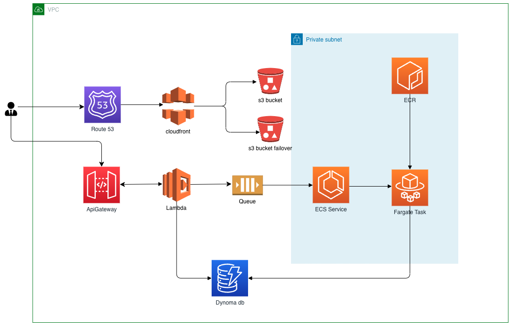

# AM-Task

To Run: "Terraform apply"

Some Points to consider:
1. I have not applied this terraform and generated plan and checked resource configurations.
2. Aws Lambda+API Gateway will be used for SERVICE-1 which will be sending messages to the queue and same will be deployed using serverless.
3. Aws diagram attached.

Explation:
1. User gets a UI from route53 -> cloudfront -> s3bucket.
2. User request flows from api linked in UI app and reaches apiGateway -> lambda.
3. Lambda processes the request and update SQS accordinly.
4. ECR service polls SQS and runs fargate task as per the message.